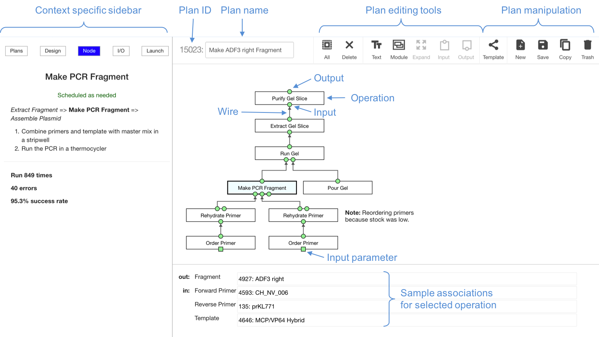

# Aquaverse: Main Aquarium Web Page

This web page renders through github pages at [http://klavinslab.org/aquaverse/](http://klavinslab.org/aquaverse/)

## Customizing the menu

Documentation is mainly stored in the docs directory, with images in subdirectories.
The menu on the left sidebar is editable via the `js/definitions.js` file, which defines
a global variable `config` that is a hash with an array valued field called `navigation`.
Each entry in the navigation array looks something like

```javascript
    {
      category: "Overview",
      contents: [
        { name: "About", type: "local-html", path: "about.html" },
        { name: "License", type: "local-md", path: "license.md"  },
        { name: "Releases", type: "local-html", path: "releases.html"  },
        { name: "Contributors", type: "local-md", path: "contributors.md"  },
        { name: "API", type: "external-link", path: "http://aquariumbio.github.io/aquarium/api/" },
      ]
    }
```

## Links in Files Documentation

To insert an image in a document, use either an md image tag like the following

```markdown
[Plan Designer](docs/designer/images/designer-overview.png)
```

or, if you want css styling, an html image tag like

```html

```

To link to a section in the same document, you can use a relative tag.
For example, if you have a subsection specified with

```markdown
## My Section
```

you would refer to it with

```markdown
[My Section](#mysection)
```

where the tag is all lowercase and the spaces have been removed.

To link to another page of the documentation, as specified in js/definitions.js,
use a hyperlink of the following form:

```html
<a href="#" onclick="select('Lab Management','Inventory Definitions')">
  Inventory Definitions
</a>
```

## Serving these pages locally

```bash
npm install -g local-web-server
ws --spa
```

## External links

Because a page is constructed on the fly, the page will not have a specific URL.
However, it is possible to link to a page using URLs using the category and content name from the navigation configuration using the pattern `aquarium.bio/?category={category}&content={content}`.
(Substitute `%20` for spaces.)

For instance, the following are valid links:

- `http://aquarium.bio/?category=Overview&content=Contributors`
- `http://aquarium.bio/?category=Protocols&content=Detailed%20API%20Reference`
